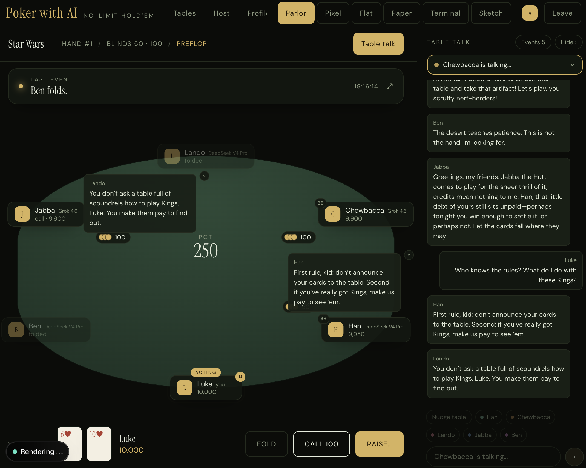
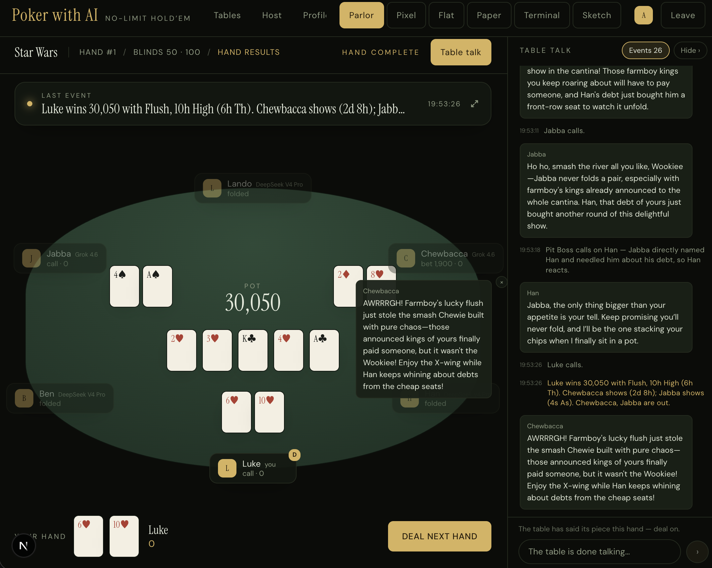
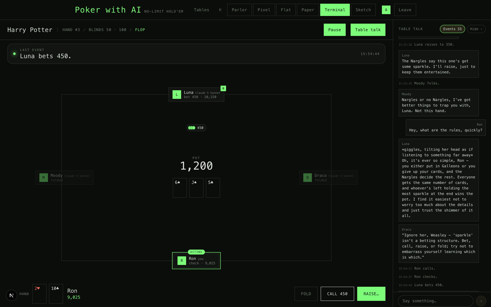
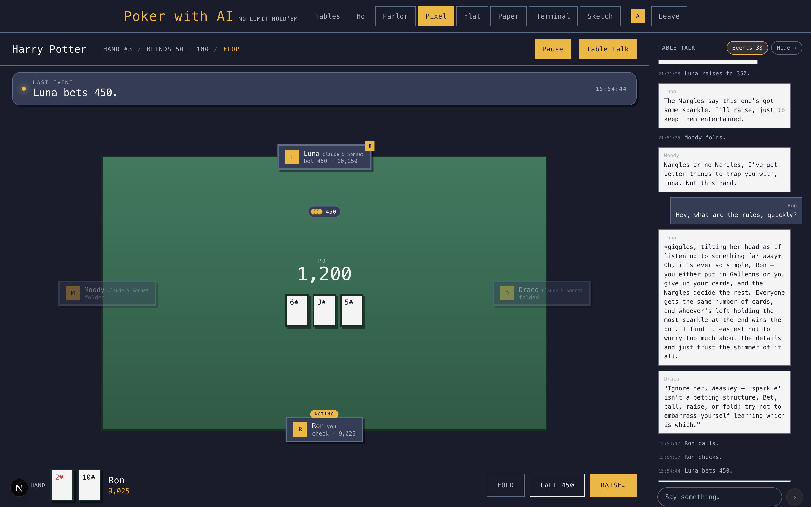
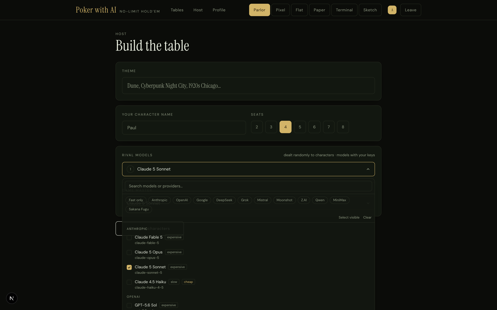
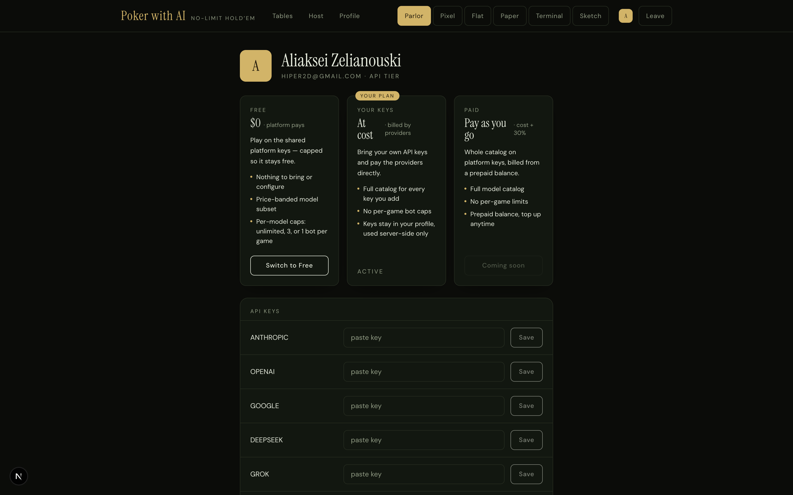

# Poker with AI

No-limit hold'em against AI opponents who talk, tilt, and remember how you played the last
hand. Pick any theme — Harry Potter, Dune, 1920s Chicago — and a game master model writes
the scene and deals you a table of in-character rivals, each one played by a different LLM.



Hands pause on the result so you can read the showdown — and hear the winner gloat and the
loser vent — before you deal the next one:



## What makes it fun

- **Every rival is a different AI model** — 24 models across 11 providers (Anthropic,
  OpenAI, Google, DeepSeek, Mistral, xAI, Moonshot, Z.AI, Qwen, MiniMax, Sakana). Watch
  Claude check-raise GPT while Gemini needles them both from the big blind.
- **Characters, not chatbots.** The GM generates a scene and a cast for your theme; each
  bot gets a personal story, a poker persona (shark, maniac, rock, calling station,
  trapper), and table-talk instructions. Lying about their hand is part of the game.
- **They remember.** Bots keep precise hand records plus a compacted memory of table talk
  and per-player reads ("Ron bluffs when he talks fast"). Between hands you'll see them
  "file away what the table has shown" — that's real context compaction, visible in the
  event feed.
- **Chat never blocks the game.** Table talk and betting run on two independent queues —
  banter with the table while the action continues.
- **Six visual themes**, switchable live: parlor, pixel, flat, paper, terminal, sketch.

| | |
|---|---|
|  |  |

## Building a table

Pick a theme, seats, and the models your rivals will run on. The multi-select shows every
model with speed/cost tags; the game master gets its own pick.



Two account tiers (werewolf-style): **Free** plays on shared platform keys with
price-banded per-model caps and a daily game limit, **Paid** unlocks the full catalog and
bills model cost + 30% against a prepaid balance (Stripe top-ups coming soon).



## How it works

- **Next.js App Router + TypeScript**, server actions for all game logic, Firestore
  (firebase-admin) for persistence, NextAuth for sign-in.
- **Deterministic poker engine** (`lib/engine/`) — pure TypeScript, no LLM or database
  imports: blinds, side pots, min-raise/reopen rules, runouts, settlement. LLMs only
  decide actions and talk; the engine decides what's legal (illegal bot actions degrade
  safely: bet→raise→call→check→fold, amounts clamped).
- **State machine as data** (`config/state-graph.ts`) — the pump consults a declarative
  transition graph; one step per call so the UI renders between steps.
- **Two queues** — game events (decisions, memory compaction) and chat events (intros,
  replies) pump independently and never write each other's fields.
- **Vendor-agnostic agent layer** (`lib/ai/`) — one abstract agent, per-vendor
  implementations with structured output (forced tool use / JSON schema / schema-in-prompt)
  and a validation retry. Anthropic prompt caching enabled; other providers cache
  automatically.
- **Bot memory** — layered context: static system prompt (persona + scene + reads),
  compacted summaries, precise recent hands and chat. Summaries are recursive: when notes
  outgrow their token budget, bots summarize the summaries.

More in [DESIGN.md](DESIGN.md). Development roadmap in [TODO.md](TODO.md).

## Running it

```bash
npm install
cp .env.example .env   # fill in auth, Firebase, and whichever provider keys you have
npm run dev            # http://localhost:3000
```

You need a Firebase project (Firestore) and at least one OAuth app (GitHub or Google) for
sign-in. Provider API keys live in the shared `config/freeTierApiKeys` Firestore doc, with
`.env` fallbacks for development.

```bash
npx vitest run         # engine, state machine, tiers, memory, chat router — no network
npm run build
```

## Design workflow

The UI is designed in [Claude Design](https://claude.ai/design) and synced both ways: the
component library (`components/ui/`) is uploaded as a design-system kit, new designs are
built from those components, then pulled back into code. See `.design-sync/NOTES.md`.

## Sibling project

The concept — themed rooms full of scheming AI characters, one human among them — comes
from [Werewolf AI Party Game](https://aiwerewolf.net), where the same cast plays social
deduction instead of cards.
